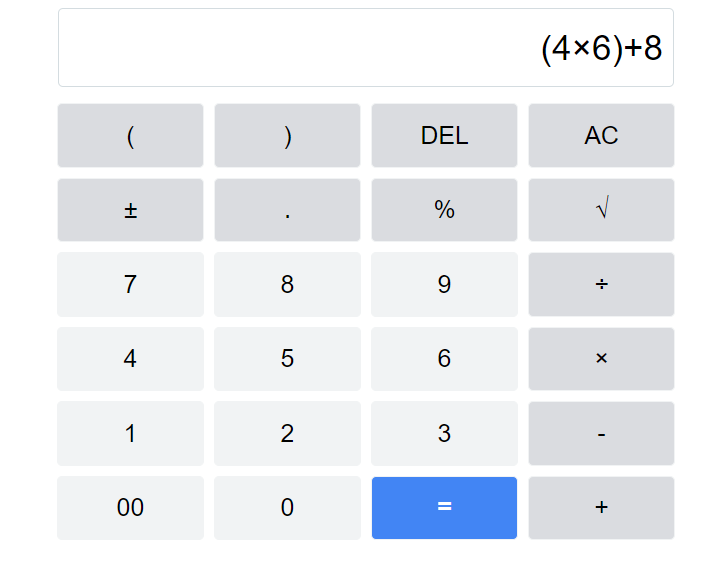
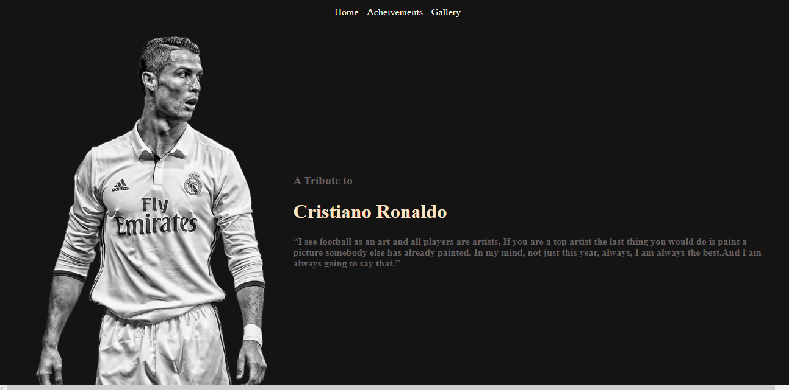
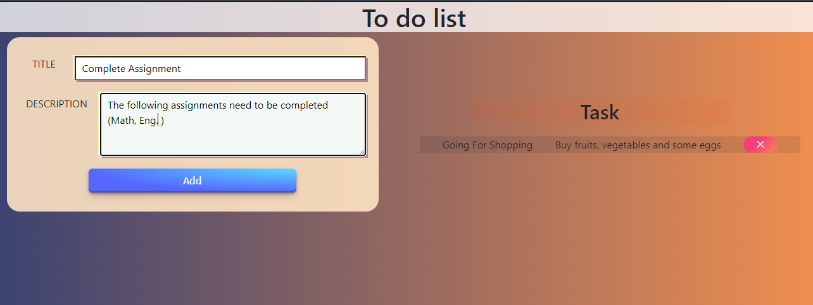

# OASIS
This GitHub repository documents the projects completed by a Web Development and Design intern at Oasis InfoByte. 
The internship included three levels of tasks designed to challenge the intern's technical and creative skills. 
Each level of task has its own folder, containing images and descriptions of the completed work.

## Task 1: Design a Calculator 

This is a simple calculator project built using HTML, CSS, and JavaScript. The calculator allows users to perform basic arithmetic operations, including addition, subtraction, multiplication, and division. It also has a clear button to reset the calculator.

### How to Use
To use the calculator, simply open the index.html file in your browser. The calculator will be displayed on the screen. Enter the first number using the number buttons, then select the desired arithmetic operation (+, -, *, /, % , √ ) using the corresponding button. Enter the second number, then press the equal button (=) to get the result. To clear the calculator, click the AC button.

### Project Structure

The project has the following files:

<a href="https://github.com/DebankanSarkar12/OIBGRIP/tree/main/Task1Calculator/index.html">index.html</a>: contains the HTML code for the calculator layout  
<a href="https://github.com/DebankanSarkar12/OIBGRIP/blob/main/Task1Calculator/style.css">style.css</a> contains the CSS code for the calculator styling   
<a href="https://github.com/DebankanSarkar12/OIBGRIP/blob/main/Task1Calculator/logic.js">logic.js:</a> contains the JavaScript code for the calculator functionality  

## Task 2: Design a Tribute Page

This is a Tribute Page  built using HTML, CSS. A tribute page is a web page where we mention our favorite person and write down their achievements. For example, here, we will create a tribute page for the footballer Cristiano Ronaldo

### How to Use
To use the Tribute Page download the files and run the cascd.html to view the Tribute Page .

### Project Structure

The project has the following files:

<a href="https://github.com/DebankanSarkar12/OIBGRIP/blob/main/Task2 Tribute Page/cascd.html">cascd.html</a>: contains the HTML code for the TributePage   
<a href="https://github.com/DebankanSarkar12/OIBGRIP/blob/main/Task2 Tribute Page/style.css">style.css</a> contains the CSS code for the TributePage styling   

## Task 1: Design a To-Do App

This is a simple To-Do project built using HTML, CSS, and JavaScript. ToDo List App is a kind of app that generally used to maintain our day-to-day tasks or list everything that we have to do, with the most important tasks at the top of the list, and the least important tasks at the bottom. It is helpful in planning our daily schedules.

### How to Use
To use the To-Do App simply open the todo.html file in your browser. Add proper Title and Description to the To-Do list and click on the Add button . The required task will be added to the right panel of the page . To delete the required task click on the cross button . 

### Project Structure

The project has the following files:

<a href="https://github.com/DebankanSarkar12/OIBGRIP/blob/main/Task3%20ToDo/todo.html">todo.html</a>: contains the HTML code for the To Do list  
<a href="https://github.com/DebankanSarkar12/OIBGRIP/blob/main/Task3%20ToDo/todo.css">todo.css</a> contains the CSS code for the To Do styling   
<a href="https://github.com/DebankanSarkar12/OIBGRIP/blob/main/Task3%20ToDo/todo.js">todo.js:</a> contains the JavaScript code for To Do functionality  

### My Experience at Oasis InfoByte

### Contributing

Contributions to the project are welcome. If you find any bugs or have suggestions for improvements, feel free to open an issue or a pull request.

